# AIQMS3 — Hướng dẫn sử dụng

**AIQMS3** là hệ thống *Đảm bảo chất lượng & Kiểm định chương trình đào tạo tích hợp AI*. Tài liệu này hướng dẫn sử dụng theo từng màn hình, kèm ghi chú thao tác.

> Ảnh minh hoạ chụp từ dữ liệu demo (chương trình **MIS** và **CS**). Giao diện hỗ trợ song ngữ **Việt/Anh** (nút 🌐 trên thanh trên cùng).

---

## Mục lục
1. [Đăng nhập & giao diện chung](#1-đăng-nhập--giao-diện-chung)
2. [Bảng điều khiển](#2-bảng-điều-khiển)
3. [Chương trình & học thuật](#3-chương-trình--học-thuật)
4. [Kiểm định](#4-kiểm-định)
5. [Phân tích chất lượng (AI)](#5-phân-tích-chất-lượng-ai)
6. [Dữ liệu & phân tích](#6-dữ-liệu--phân-tích)
7. [Trợ lý AI & Thông báo](#7-trợ-lý-ai--thông-báo)
8. [Hệ thống & quản trị](#8-hệ-thống--quản-trị)
9. [Phụ lục: vai trò, quyền & vận hành](#9-phụ-lục-vai-trò-quyền--vận-hành)

---

## 1. Đăng nhập & giao diện chung

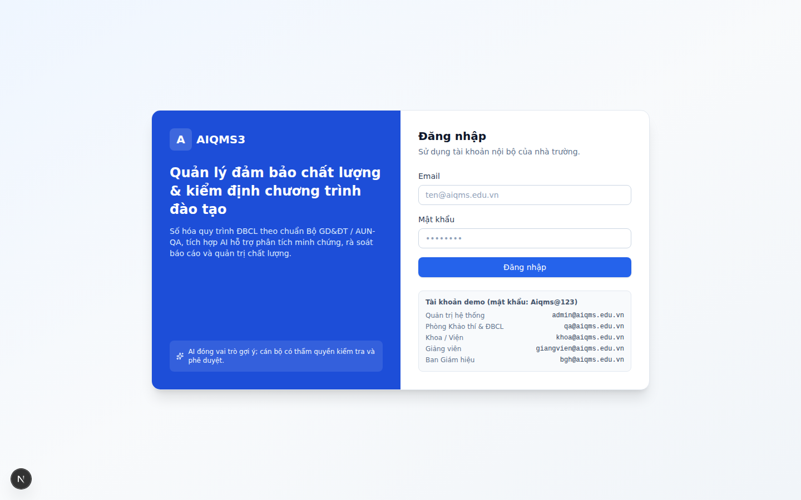

**Mục đích:** xác thực người dùng (JWT, phiên 7 ngày).

**Thao tác:**
1. Nhập **email** và **mật khẩu** → bấm **Đăng nhập**.
2. Tài khoản quản trị demo: `admin@aiqms.edu.vn` / `Aiqms@123`.

**Ghi chú giao diện chung (thanh trên cùng & menu trái):**
- 🟢/🟡 **AI: Claude / Dự phòng** — trạng thái AI. "Dự phòng" nghĩa là chưa cấu hình API key (vẫn chạy với kết quả tất định).
- 🌐 **VI / EN** — chuyển ngôn ngữ giao diện (lưu theo cookie).
- 🔔 **Chuông** — thông báo chưa đọc (xem mục 7).
- **Menu trái** chia nhóm: *Tổng quan, Chương trình & học thuật, Kiểm định, Phân tích chất lượng (AI), Dữ liệu & phân tích, Hệ thống*. Menu **chỉ hiển thị mục mà vai trò của bạn được phép**.
- Hầu hết trang có **bộ chọn chương trình** (góc phải) để xem dữ liệu theo từng CTĐT.

---

## 2. Bảng điều khiển

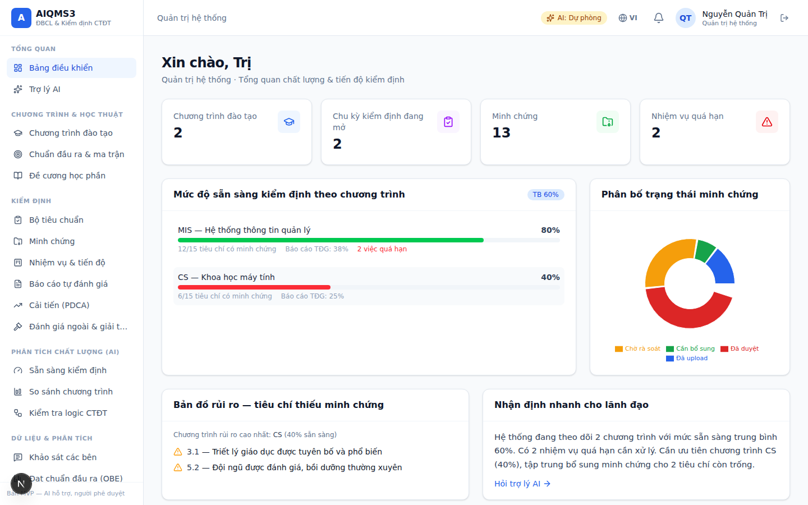

**Mục đích:** tổng quan nhanh chất lượng & tiến độ kiểm định cho lãnh đạo/điều phối.

**Trên màn hình:**
- 4 thẻ KPI: số **chương trình**, **chu kỳ đang mở**, **minh chứng**, **nhiệm vụ quá hạn**.
- **Mức độ sẵn sàng kiểm định theo chương trình** (thanh % từng CTĐT).
- **Phân bố trạng thái minh chứng** (biểu đồ tròn).
- **Bản đồ rủi ro** — tiêu chí thiếu minh chứng, ưu tiên xử lý.
- **Nhận định nhanh cho lãnh đạo** — tóm tắt AI; bấm *Hỏi trợ lý AI* để hỏi sâu hơn.

**Ghi chú:** số liệu cập nhật trực tiếp từ dữ liệu nhập; "% sẵn sàng" ở đây là tỷ lệ tiêu chí đã có minh chứng (xem điểm trọng số chi tiết ở *Sẵn sàng kiểm định*).

---

## 3. Chương trình & học thuật

### 3.1. Chương trình đào tạo

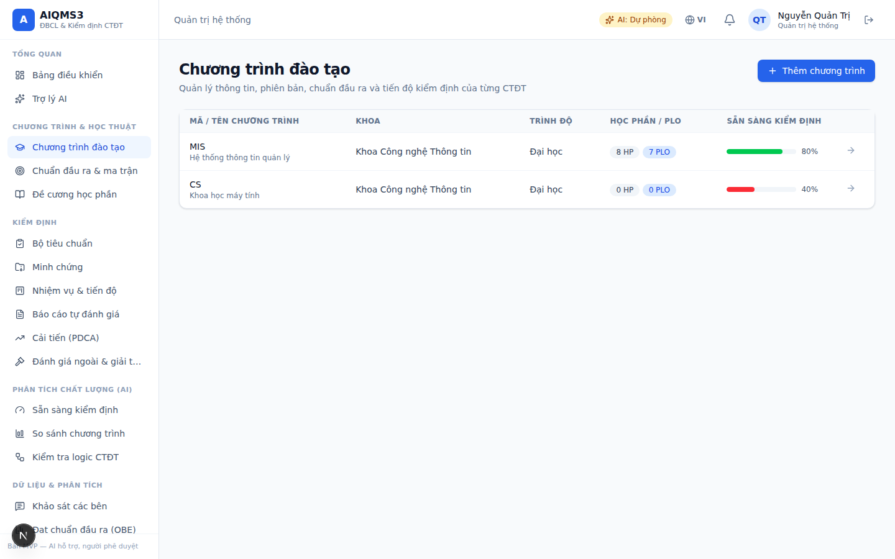

**Mục đích:** quản lý CTĐT.

**Thao tác:** bấm **Thêm chương trình** để tạo mới; bấm một chương trình để xem chi tiết.

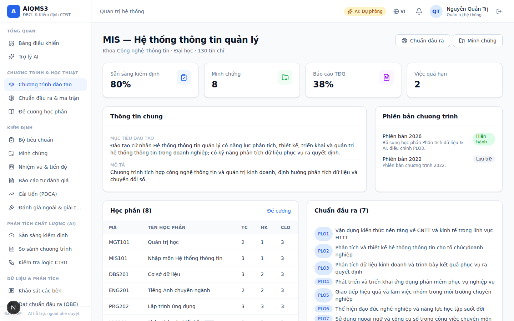

**Trên màn hình chi tiết:**
- KPI: sẵn sàng, số minh chứng, tiến độ SAR, việc quá hạn.
- **Phiên bản chương trình** — lịch sử cập nhật CTĐT (mỗi phiên bản có trạng thái).
- **Học phần**, **Chuẩn đầu ra (PLO)**, **Chu kỳ kiểm định**.
- **Phân công vai trò** — danh sách người dùng được gán vai trò *trong chương trình này* (cấu hình tại *Quản trị người dùng*).

**Ghi chú:** Người dùng được gán vai trò phạm vi chương trình chỉ nhìn thấy đúng chương trình đó và được **nâng quyền cục bộ** trong phạm vi đó.

### 3.2. Chuẩn đầu ra & ma trận

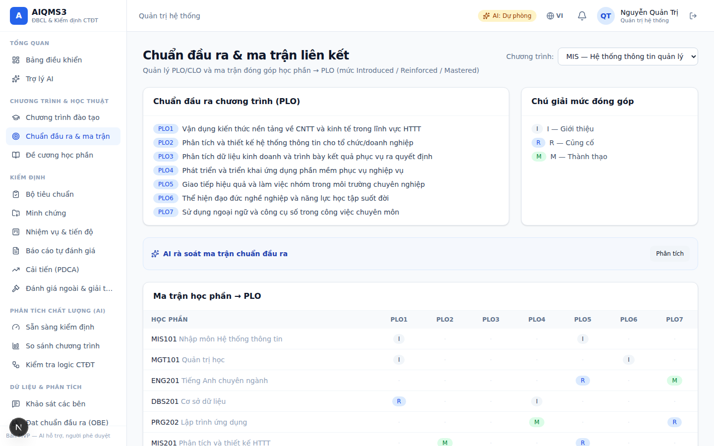

**Mục đích:** quản lý **PLO** (chuẩn đầu ra chương trình), **CLO** (chuẩn đầu ra học phần) và các **ma trận** liên kết (PLO–học phần, CLO–PLO).

**Ghi chú:** ma trận là căn cứ cho *Kiểm tra logic CTĐT* (mục 5.3) và đánh giá OBE (mục 6.2).

### 3.3. Đề cương học phần

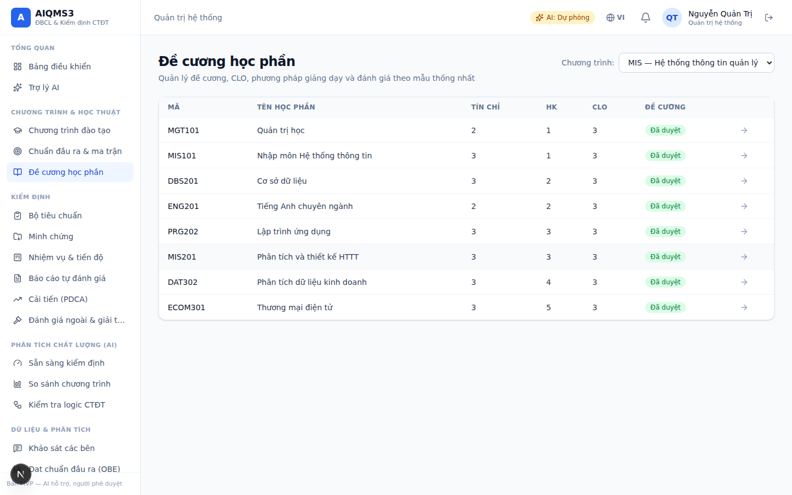

**Mục đích:** quản lý đề cương từng học phần (CLO, phương pháp dạy–học, phương pháp đánh giá, rubric).

**Thao tác:** mở một học phần để xem/sửa đề cương; dùng **AI rà soát đề cương** để kiểm tra tính tương thích (constructive alignment) CLO ↔ đánh giá.

---

## 4. Kiểm định

### 4.1. Bộ tiêu chuẩn

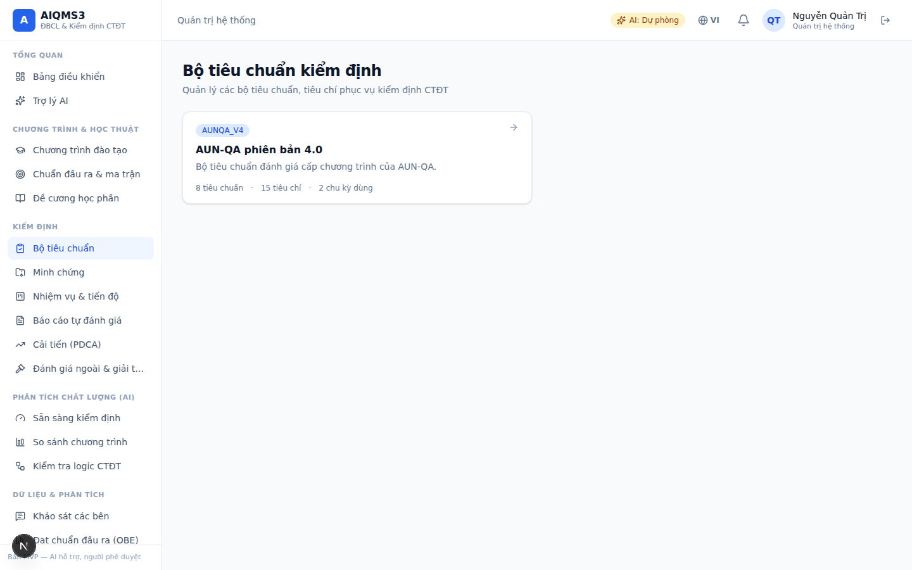

**Mục đích:** quản lý bộ tiêu chuẩn/tiêu chí kiểm định (mặc định **AUN-QA**, cấu hình được, đa bộ chuẩn).

**Ghi chú:** mỗi chu kỳ kiểm định gắn với một bộ tiêu chuẩn; tiêu chí là nơi gắn minh chứng và viết báo cáo.

### 4.2. Minh chứng

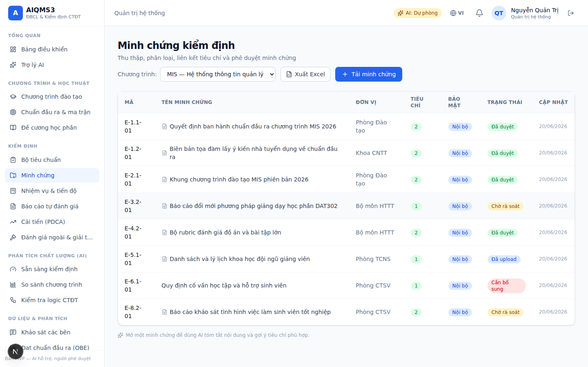

**Mục đích:** thu thập, phân loại, gắn tiêu chí và phê duyệt minh chứng.

**Thao tác:**
1. **Tải minh chứng** → nhập mã, tên, đơn vị, mức bảo mật, đính kèm tệp (PDF/DOCX/XLSX/TXT).
2. **Xuất Excel** — tải danh mục minh chứng (kèm độ mạnh, trạng thái).

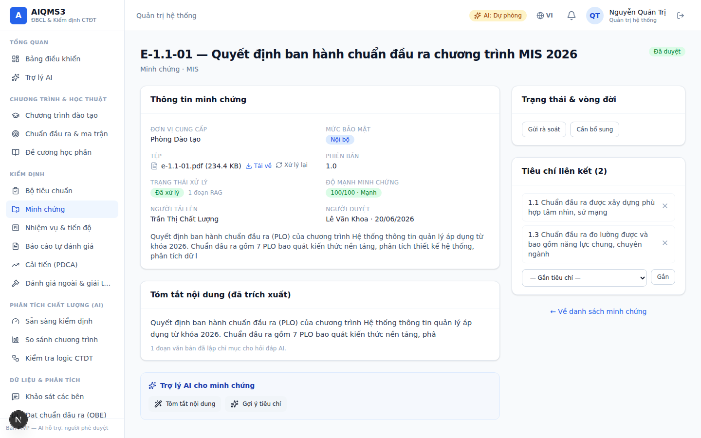

**Trên màn hình chi tiết:**
- **Trạng thái xử lý** — tệp tải lên được **xử lý nền** (Đang xử lý → Đã xử lý / Lỗi): trích xuất văn bản + lập chỉ mục RAG cho hỏi đáp AI.
- **Tải về** tệp gốc; **Xử lý lại** nếu cần trích xuất lại.
- **AI tóm tắt** nội dung & **gợi ý tiêu chí** phù hợp.
- **Gắn/bỏ tiêu chí**; **Độ mạnh minh chứng** (thang điểm).
- **Phê duyệt / Cần bổ sung** (vai trò có quyền) → tự **thông báo** cho người tải lên.

**Ghi chú:** file gốc lưu ở kho đối tượng (Cloud Storage trên production), CSDL chỉ giữ metadata; tệp lớn/nhạy cảm phục vụ qua **signed URL**.

### 4.3. Nhiệm vụ & tiến độ

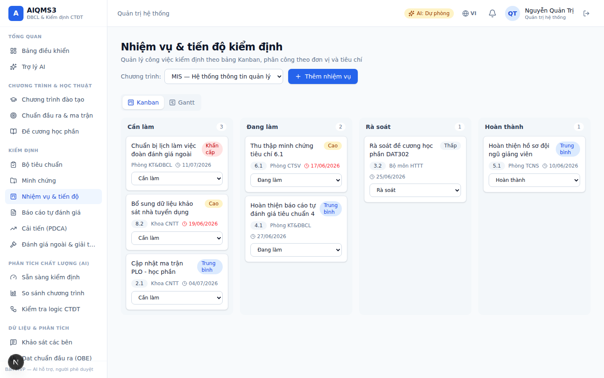

**Mục đích:** quản lý công việc kiểm định, phân công theo đơn vị/tiêu chí.

**Thao tác:** **Thêm nhiệm vụ** (có *ngày bắt đầu*, *hạn*, ưu tiên, tiêu chí). Kéo trạng thái trên **Kanban**: Cần làm → Đang làm → Rà soát → Hoàn thành.

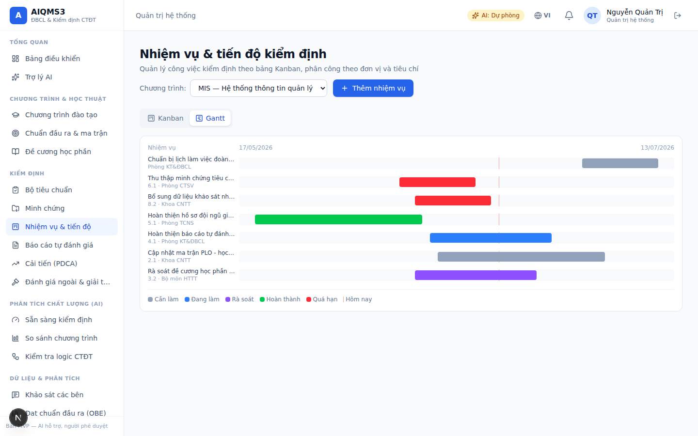

**Chế độ Gantt:** bấm **Gantt** để xem dòng thời gian. Thanh tô màu theo trạng thái, **đỏ = quá hạn**, vạch dọc = **hôm nay**.

### 4.4. Báo cáo tự đánh giá (SAR)

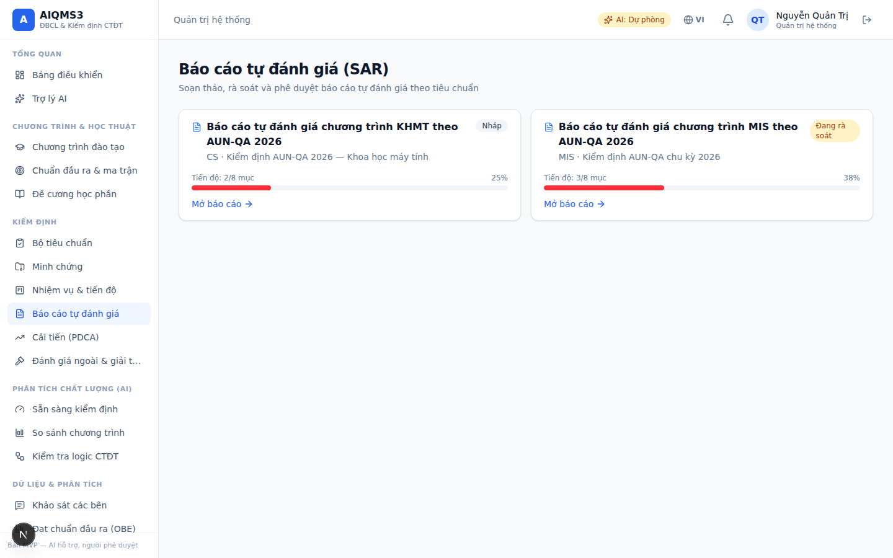

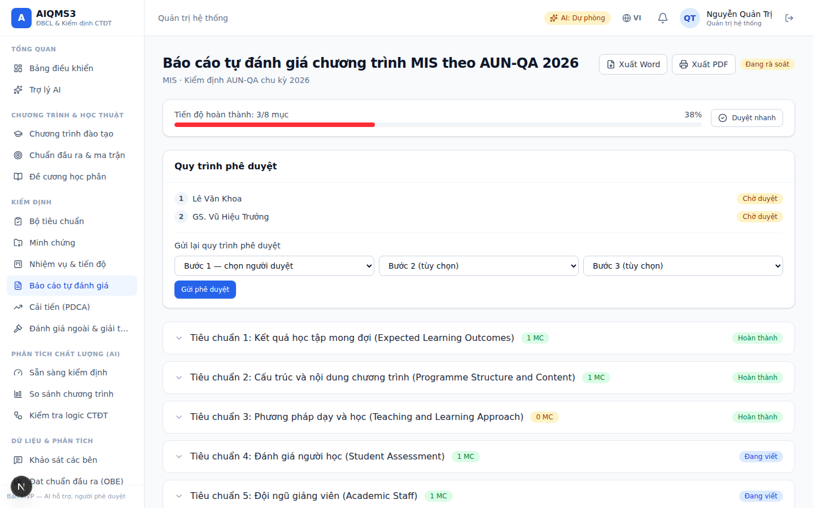

**Mục đích:** soạn báo cáo tự đánh giá theo tiêu chuẩn, kèm AI hỗ trợ và quy trình phê duyệt.

**Trên màn hình:**
- **Tiến độ hoàn thành** theo số mục.
- **Xuất Word / Xuất PDF** — kết xuất SAR (bìa + từng tiêu chí).
- **Quy trình phê duyệt** — chọn chuỗi người duyệt theo thứ tự (Bước 1→3) rồi **Gửi phê duyệt**; theo dõi trạng thái từng bước. **Duyệt nhanh** dành cho vai trò có quyền duyệt trực tiếp.
- Mỗi **tiêu chí**: viết *Mô tả hiện trạng, Điểm mạnh, Tồn tại, Kế hoạch cải tiến*; dùng **AI soạn/rà soát** và xem số minh chứng đã gắn.

### 4.5. Phê duyệt

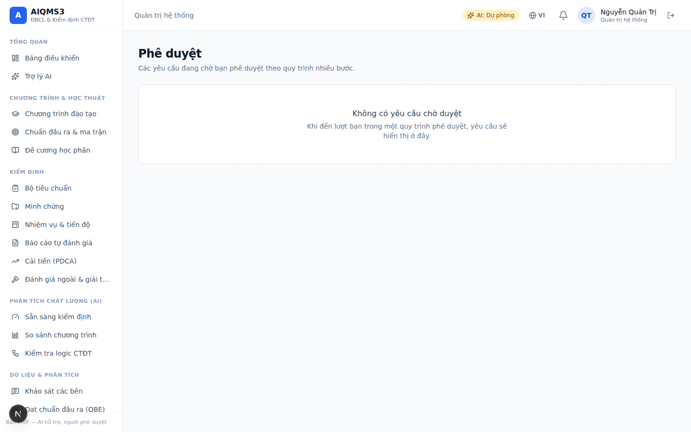

**Mục đích:** hộp thư phê duyệt cá nhân (quy trình nhiều bước).

**Thao tác:** với mỗi yêu cầu **đến lượt bạn**, nhập ý kiến (tuỳ chọn) rồi **Phê duyệt** hoặc **Từ chối**. Phê duyệt sẽ chuyển sang bước kế tiếp; bước cuối hoàn tất sẽ **chốt** báo cáo. Mọi chuyển bước đều gửi **thông báo**.

### 4.6. Cải tiến (PDCA)

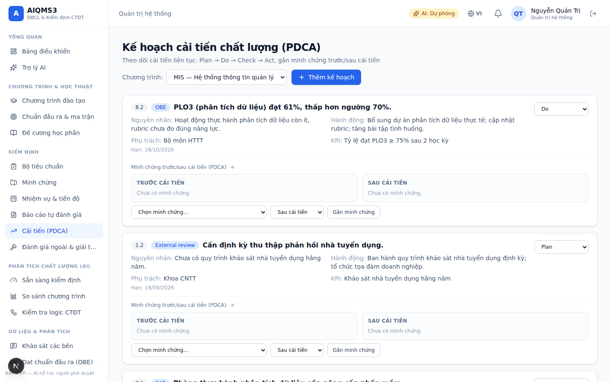

**Mục đích:** quản lý cải tiến liên tục Plan–Do–Check–Act.

**Thao tác:** thêm kế hoạch (vấn đề, nguyên nhân, hành động, KPI, phụ trách, hạn); cập nhật trạng thái PDCA; **gắn minh chứng Trước/Sau cải tiến** để chứng minh hiệu quả (khép vòng).

### 4.7. Đánh giá ngoài & giải trình

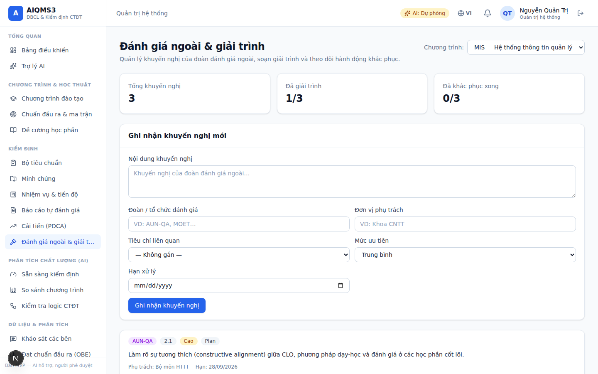

**Mục đích:** quản lý khuyến nghị của đoàn đánh giá ngoài và soạn giải trình.

**Thao tác:** ghi nhận khuyến nghị (đoàn, tiêu chí, ưu tiên, hạn); dùng **AI gợi ý giải trình** (tiếp thu → hiện trạng → khắc phục PDCA → mốc thời gian); theo dõi trạng thái xử lý.

---

## 5. Phân tích chất lượng (AI)

### 5.1. Sẵn sàng kiểm định

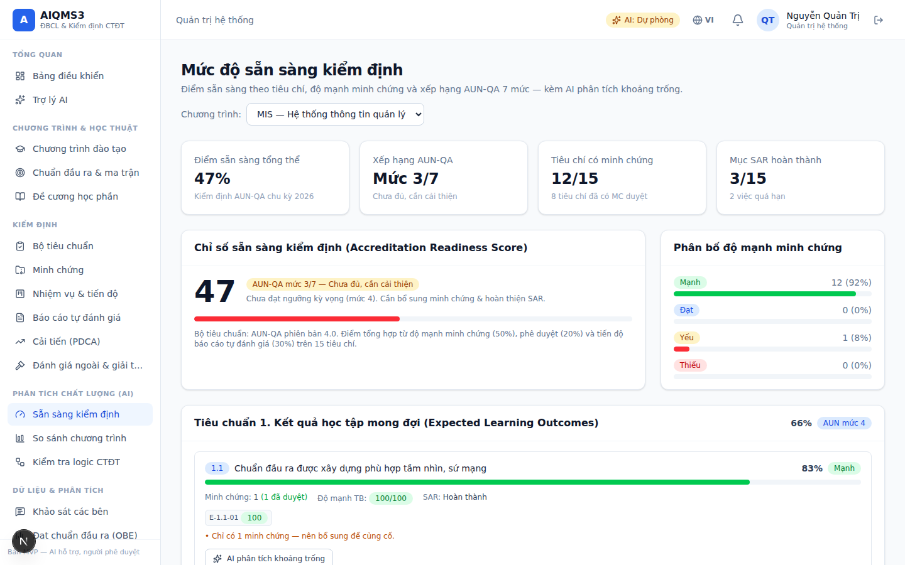

**Mục đích:** chấm điểm mức sẵn sàng theo từng tiêu chí + **AI Gap Analysis** (phân tích khoảng trống) và **độ mạnh minh chứng**.

**Ghi chú:** kết quả quy đổi sang **hạng AUN-QA (1–7)**; nêu rõ tiêu chí thiếu/yếu để ưu tiên xử lý.

### 5.2. So sánh chương trình (Benchmark)

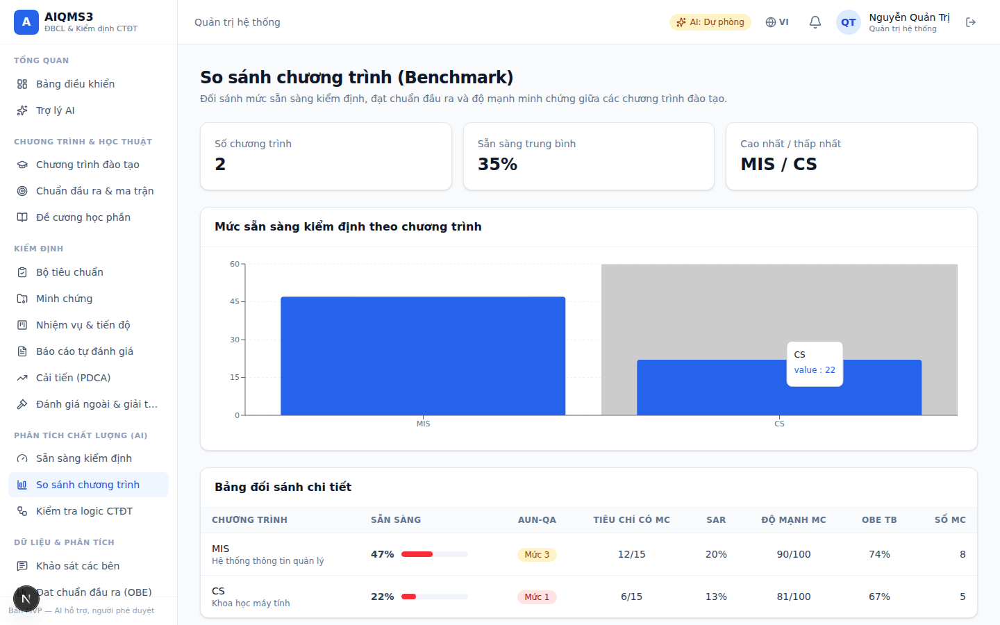

**Mục đích:** đối sánh **mức sẵn sàng, hạng AUN, OBE, độ mạnh minh chứng, tiến độ SAR** giữa các CTĐT cấp trường (biểu đồ cột + bảng chi tiết).

### 5.3. Kiểm tra logic CTĐT

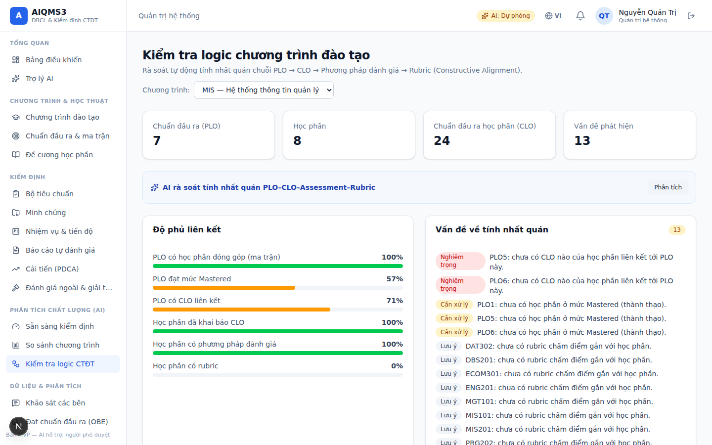

**Mục đích:** rà soát tính nhất quán **PLO → CLO → Phương pháp đánh giá → Rubric** (constructive alignment), phát hiện PLO/CLO chưa được phủ.

---

## 6. Dữ liệu & phân tích

### 6.1. Khảo sát các bên

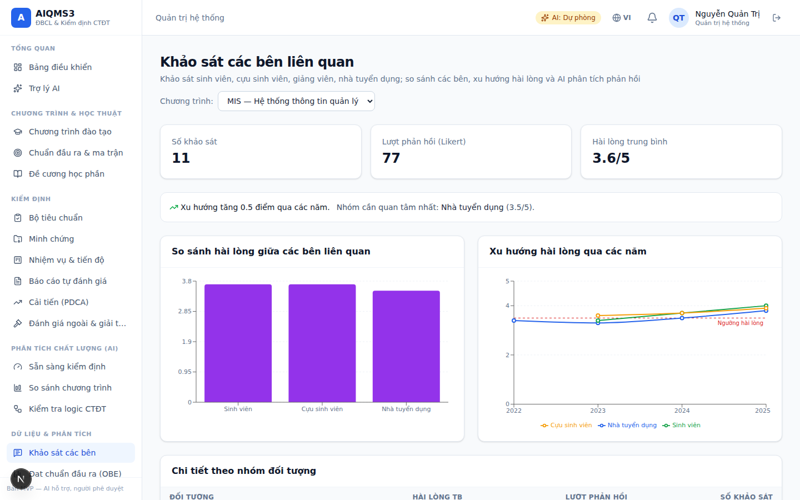

**Mục đích:** khảo sát sinh viên, cựu SV, giảng viên, nhà tuyển dụng.

**Trên màn hình:** **so sánh hài lòng giữa các bên**, **xu hướng hài lòng qua các năm**, bảng chi tiết; AI phân tích phản hồi mở.

### 6.2. Đạt chuẩn đầu ra (OBE)

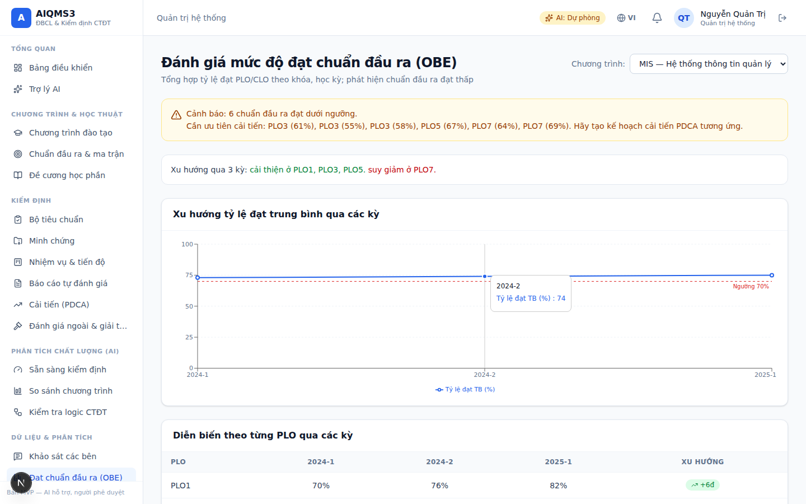

**Mục đích:** theo dõi mức đạt **chuẩn đầu ra (PLO)** theo khóa/kỳ, **xu hướng đa chu kỳ**, cảnh báo PLO dưới ngưỡng.

---

## 7. Trợ lý AI & Thông báo

### 7.1. Trợ lý AI kiểm định

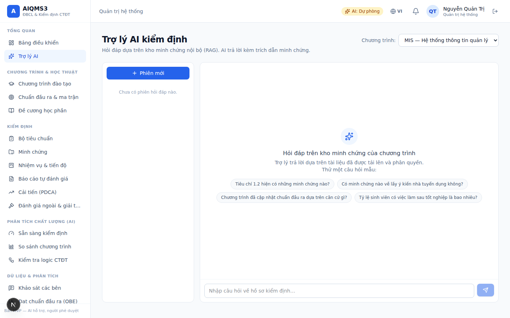

**Mục đích:** hỏi đáp dựa trên **kho minh chứng nội bộ (RAG)**; AI trả lời **kèm trích dẫn minh chứng**.

**Thao tác:** chọn chương trình → đặt câu hỏi. Cột trái lưu **lịch sử phiên** (mở lại/xóa); bấm **Phiên mới** để bắt đầu cuộc khác.

**Ghi chú:** AI chỉ truy hồi tài liệu trong phạm vi quyền của bạn; nếu chưa bật API key, hệ thống dùng chế độ dự phòng tất định.

### 7.2. Thông báo

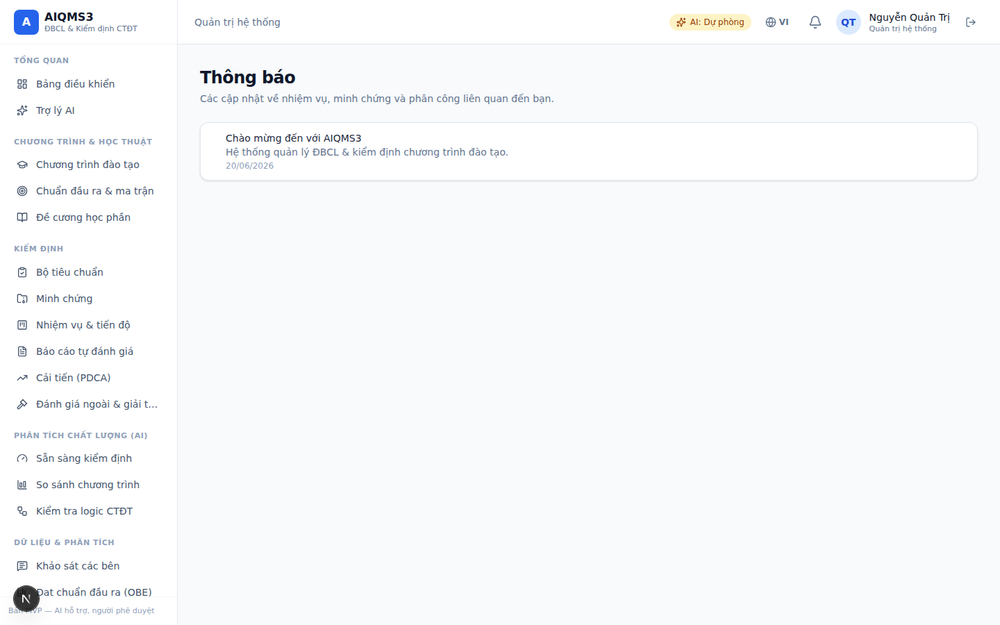

**Mục đích:** cập nhật liên quan đến bạn (duyệt minh chứng, được giao vai trò, đến lượt phê duyệt…).

**Thao tác:** bấm 🔔 trên thanh trên cùng để xem nhanh & đánh dấu đã đọc; **Xem tất cả** mở trang này.

---

## 8. Hệ thống & quản trị

### 8.1. Quản trị người dùng

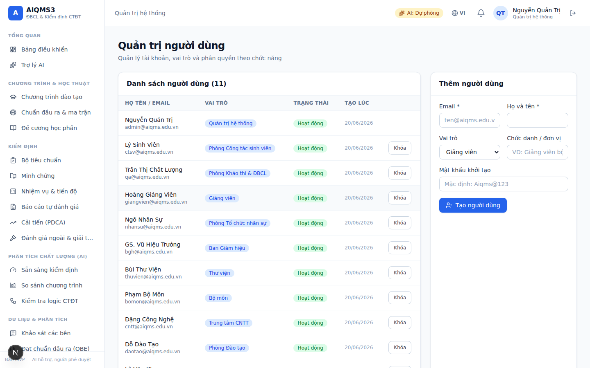

**Mục đích (vai trò ADMIN):** quản lý tài khoản và phân quyền.

**Thao tác:**
- **Thêm người dùng**, **Khóa/Mở khóa** tài khoản.
- **Gán vai trò theo chương trình** — chọn người dùng + chương trình + vai trò: giới hạn phạm vi truy cập và **nâng quyền cục bộ** trong chương trình đó. Người được gán nhận **thông báo**.

### 8.2. Cấu hình AI

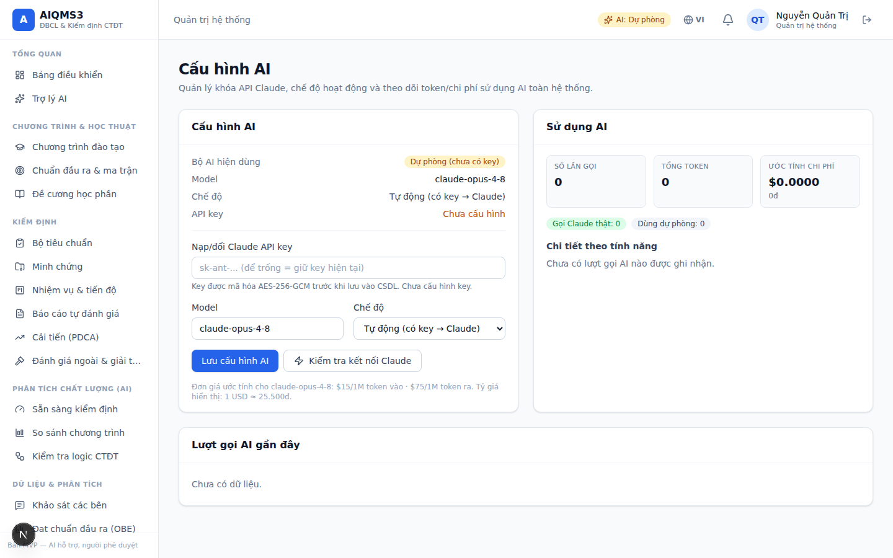

**Mục đích (ADMIN):** cấu hình Claude API và theo dõi chi phí.

**Thao tác:** nhập **API key** (mã hóa lưu trong CSDL), chọn **model**, chế độ (*auto/real/mock*), **Kiểm tra kết nối**. Theo dõi **token & chi phí** ước tính theo tính năng/lượt gọi.

**Ghi chú:** key lưu trong CSDL đè biến môi trường → đổi key **không cần redeploy**.

### 8.3. Nhật ký hệ thống

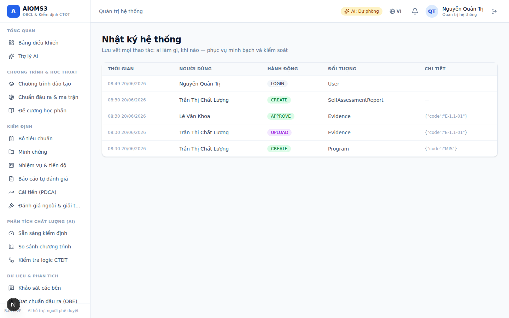

**Mục đích:** truy vết mọi thao tác quan trọng (tải lên, sửa, phê duyệt, gợi ý AI…) phục vụ minh bạch & giải trình.

---

## 9. Phụ lục: vai trò, quyền & vận hành

### 9.1. Vai trò hệ thống
ADMIN, Ban Giám hiệu, Phòng Khảo thí & ĐBCL, Phòng Đào tạo, Khoa/Viện, Bộ môn, Giảng viên, Phòng TCNS, Thư viện, Trung tâm CNTT, Phòng CTSV.

- **Vai trò toàn trường** (ADMIN, Ban Giám hiệu, Khảo thí & ĐBCL, Đào tạo) thấy mọi chương trình.
- **Vai trò theo phạm vi** chỉ thấy chương trình được gán (tại *Quản trị người dùng*). Trong phạm vi đó, quyền = quyền hệ thống **∪** quyền của vai trò được gán.
- **Nguyên tắc:** AI chỉ **gợi ý** (con người phê duyệt); AI **trích nguồn**, không bịa số liệu; tuân thủ phân quyền kể cả khi truy hồi RAG.

### 9.2. Bật tính năng nâng cao (cho quản trị hệ thống/DevOps)
- **AI thật:** đặt API key tại *Cấu hình AI* hoặc biến môi trường `ANTHROPIC_API_KEY`.
- **Lưu trữ minh chứng trên Cloud Storage:** `STORAGE_DRIVER=gcs`, `GCS_BUCKET`, `GCS_PROJECT_ID` (xem `docs/09_DEPLOYMENT_GUIDE.md`).
- **Tìm kiếm vector pgvector** (khi nhiều minh chứng): `RAG_DRIVER=pgvector` + `npm run rag:pgvector`.

> Chi tiết triển khai/hạ tầng: xem `docs/09_DEPLOYMENT_GUIDE.md`. Lộ trình & phạm vi: `docs/10_ROADMAP.md`.
